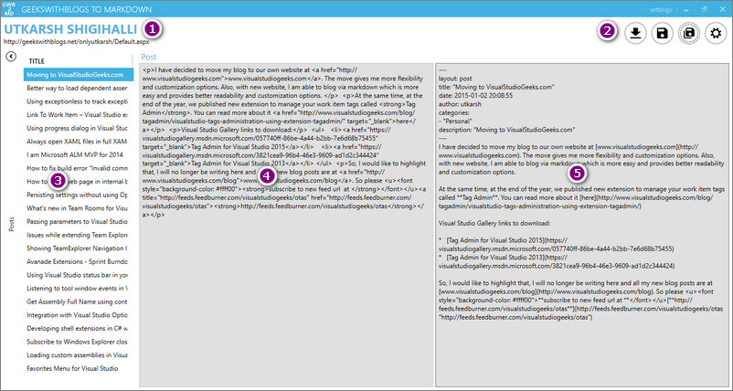
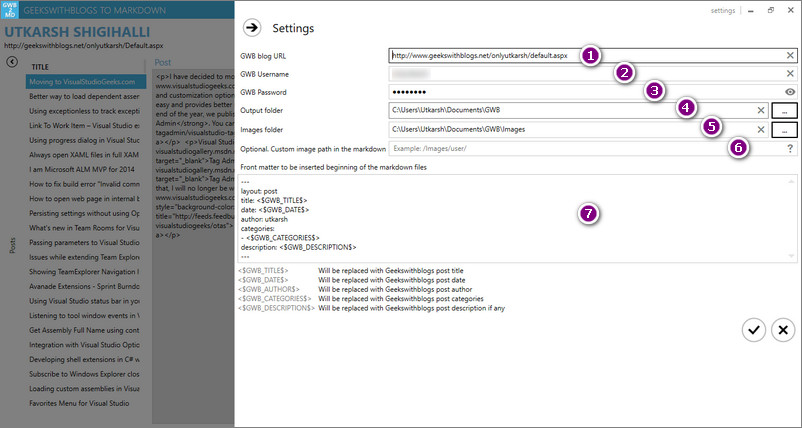

# GeeksWithBlogs To Markdown #

Do you host your blog posts in [GeeksWithBlogs.net](http://www.geekswithblogs.net) (GWB)? Well you probably know then that, GWB does not provide any means to download/backup your posts. This is big problem if if you want to move to another hosting provider like GitHub/Wordpress and you cannot download any your existing posts. Fortunately, GWB posts are in MetaWebBlog format and with some simple C# code you can backup your blog posts. 

I host my blog at [http://www.visualstudiogeeks.com](http://www.visualstudiogeeks.com) using Jekyll engine and wanted a quick way to convert all my posts in the markdown format. This utility provides a quick way to fetch your posts from GWB and save them as markdown.

> See the [changelog](CHANGELOG.md) for changes and roadmap.

## Features ##

- View all your blog posts.
- Save individual posts or all as markdown files.
- Ability to add optional frontmatter (necessary if you are hosting in GitHub for example).
- Dynamically insert GWB author name, post date and categories.
- Download images in the posts
- GWB returns image name in the posts as `image001.jpg` - this tool automatically renames the images with the post tile slug (ex: postdate_in_yymmdd_post_title.jpg)
- Optionally overwrite image path in the markdown - might be useful when you host the images in root of your folder in your git repo and want to refer images with the full path.

## Walkthrough ##

1. Run the GeeksWithBlogsToMarkdown.exe
2. Enter your GWB blog details in settings
3. Click Get posts icon (first icon) from the Main window from top-right options
4. Click Save/Save all button to save the post as markdown

> Once you click save/save all button, following operations are performed
  1. Download the images and rename them with the post slug.
  2. Markdown is generated
  3. Add any frontmatter after replacing any custom tags (`<$GWB_...$>`) with the actual values
  4. Replace the image URL with the downloaded images - If custom image path is specified that path is used.
  
## Screenshots ##

### Main UI ###

1. Blog post tile and URL from GWB
2. Main menu options
	- Get Posts
	- Save this post as markdown
	- Save all posts as markdown
	- Settings
3. All the posts from GWB
4. The post HTML received from the GWB (readonly)
5. The equivalent markdown generated  (readonly)

### Settings ###

1. Full URL of your GWB blog post
2. User name you use to login to admin console
3. Password for your admin account
4. Output folder where the saved markdown needs to be saved
5. Output folder for the downloaded images
6. Optional images path to write in the markdown files

### Limitations ###
1. Does not identify languages used in the code snippets. You need to manually add triple backticks and add any languages necessary.
2. If you have referred any of your GWB blog post, the URL will be retained as is. You need to replace them manually.

	
